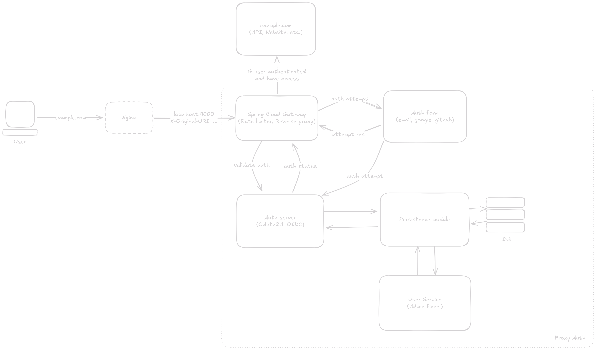

# ProxyAuth

Централизованный сервера для Single Sign-On (SSO) авторизации и аутентификации пользователей.

## Описание

На момент написания проекта я держу несколько сетевых приложений на своём виртуальном сервере, которые иногда работают по принципу "черного ящика", например запускаются в Docker контейнере. Из-за этого не всегда есть возможность изменять исходный код этих приложения, но есть необходимость в ограничении к ним доступа. В качестве решения этой проблемы я решил написать централизованный SSO сервер авторизации/аутентификации пользователей, не требующий изменения исходного кода самих приложений.

